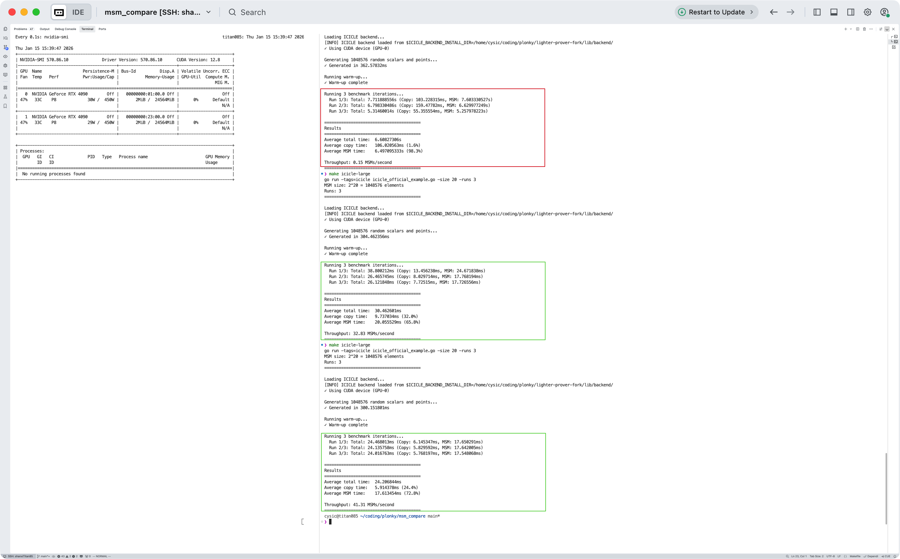

# Test Icicle MSM time

The ICICLE GPU MSM time is not stable as for $2^20$ elements:

- sometime the MSM time is about 6~7 seconds
- sometime the MSM time is less than 20 milliseconds



# How to run

```bash
make lib # download the icicle bn254 lib and backend lib
make icicle-large # run the icicle large MSM test and get msm time
```

# CPU vs GPU

```bash
make lib
make compare
```

| Degree | Size    | CPU Time  | GPU Time | Time Compare |
|--------|---------|-----------|----------|------------|
| 2^18   | 262144  | 29.00 ms  | 2.79 s   | 93.62x CPU |
| 2^19   | 524288  | 66.00 ms  | 3.83 s   | 57.23x CPU |
| 2^20   | 1048576 | 100.00 ms | 7.35 s   | 73.16x CPU |

- If GPU MSM time is not less than 20 milliseconds, it is much longer than CPU time.
- If GPU MSM time is less than 20 milliseconds, it is much faster than CPU time.